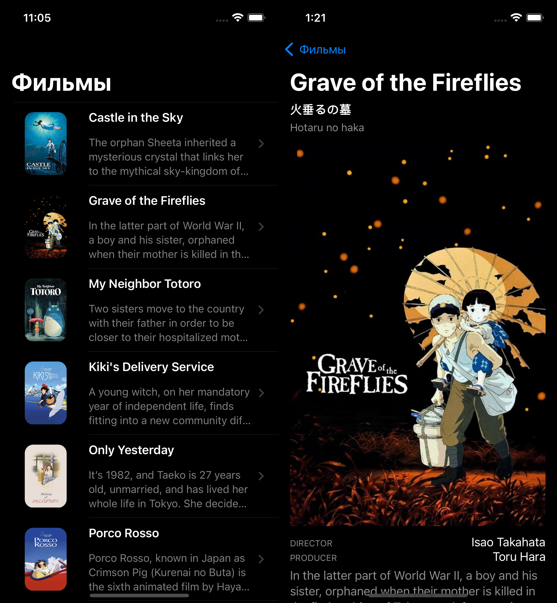
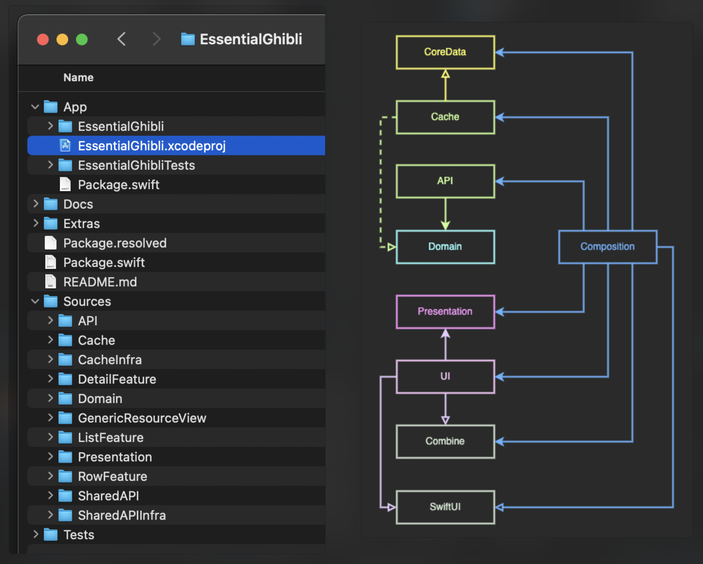
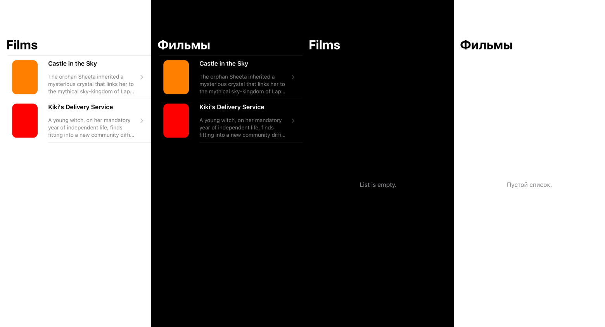

# EssentialGhibli

This is a demo app digesting the [iOS Lead Essentials](https://iosacademy.essentialdeveloper.com/p/ios-lead-essentials/) program at the [Essential Developer Academy](https://www.essentialdeveloper.com).

The app presents the feed of [Studio Ghibli](https://en.wikipedia.org/wiki/Studio_Ghibli) films.

Under the hood, it is a project with hyper-modular architecture with decoupled components, with modularity enforced by placing modules into separate targets in the `EssentialGhibli` Swift Package.

## Instructions

Open the `App/EssentialGhibli.xcodeproj` with Xcode 14.x and select the `EssentialGhibli` scheme to run the app on the simulator.

## Modules

Hyper-modular architecture

with decoupled components

### Build time

Modules dependency done right significantly reduces build time. This project is defiantly not huge, but it's clear that this approach allows utilizing Xcode parallel build system:

### Composition

The `Root Composition` is implemented in the `EssentialGhibliApp`.

### UI

UI Components are implemented with `SwiftUI`. Previews are designed to show the rendering of different state values and are covered with snapshot tests - see [Tests](#tests).

### Localization

English and Russian localizations are tested.

## Tests

Extensive use of `TDD` and test `DSL` to decouple tests from implementation details.

UI Components are tested using snapshots with [SnapshotTesting](https://github.com/pointfreeco/swift-snapshot-testing). This testing covers light/dark modes and localization.

## CI

For the demo, a simple `CI` with `GitHub actions` workflow is used: build and run all tests with scheme `CI_iOS` run on push to the `main` branch. Another workflow with the same functionality could be triggered manually. Both `YAML` scripts call `clean_build_test.sh` shell script.

## References

* [Studio Ghibli API](https://ghibliapi.herokuapp.com/#)

* [Studio Ghibli - Wikipedia](https://en.wikipedia.org/wiki/Studio_Ghibli)
