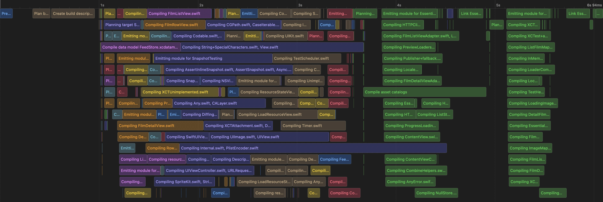

# EssentialGhibli

A demo app digesting [iOS Lead Essentials](https://iosacademy.essentialdeveloper.com/p/ios-lead-essentials/) program at the [Essential Developer Academy](https://www.essentialdeveloper.com).

The app presents the feed of the [Studio Ghibli](https://en.wikipedia.org/wiki/Studio_Ghibli) films.

Under the hood it is a project with hyper-modular architecture with decoupled components, with modularity enforced by placing modules into separate targets in the `EssentialGhibli` Swift Package.

## Instructions

Open `App/EssentialGhibli.xcodeproj` with Xcode 14.x and select `EssentialGhibli` scheme to run the app in the simulator. See [Swift 5.7 notes](#swift-57) for details.

## Modules

Hyper-modular architecture with decoupled components.


### Build time

Modules dependency done right significantly reduces build time. This project is defiantly not huge, but it's clear that this approach allows to utilize Xcode parallel build system:




### Composition

The `Root Composition` is implemented in the `EssentialGhibliApp`.

### UI

UI Components are implemented with `SwiftUI`. Previews are designed to show rendering of different state values and are covered with snapshot tests - see [Tests](#tests).

### Localization

English and Russian localizations are tested.

## Tests

Extensive use of `TDD` and test `DSL` to decouple tests from implementation details.

UI Components are tested using snapshots with [SnapshotTesting](https://github.com/pointfreeco/swift-snapshot-testing). This testing covers light/dark modes and localization.

## CI

For demo a simple `CI` with `GitHub actions` workflow is used: build and tests with scheme `CI_iOS` run on push to the `main` branch.

## Swift 5.7

Primary associated type feature of Swift 5.7 is used to simplify func signatures in test assertions (`Feed Store Specs` in `CacheInfraTests`):

before:
```swift
func assert<Store>(
    on sut: Store,
    file: StaticString = #file, 
    line: UInt = #line
) where Store: FeedStore, Store.Item == LocalFilm
```

after:

```swift
func assert(
    on sut: any FeedStore<LocalFilm>, 
    file: StaticString = #file, 
    line: UInt = #line
)
```

## Film Feed Feature Specs

### Story: User wants to see the film feed

### Narrative #1

```
As an online user
I want the app to automatically load film feed
So I can always have a list of my favorite animation studio works
```

#### Scenarios (Acceptance criteria)

```
Given the user has connectivity
 When the user requests to see the film feed
 Then the app should display the latest film field from remote
  And replace the cache with the new feed
```

### Narrative #2

```
As an offline user
I want the app to show the latest saved version of film feed
So I can always have a list of my favorite animation studio works
```

#### Scenarios (Acceptance criteria)

```
Given the user doesn't have connectivity
  And there’s a cached version of the feed
  And the cache is less than seven days old
 When the user requests to see the feed
 Then the app should display the latest feed saved

Given the user doesn't have connectivity
  And there’s a cached version of the feed
  And the cache is seven days old or more
 When the customer requests to see the feed
 Then the app should display an error message

Given the customer doesn't have connectivity
  And the cache is empty
 When the customer requests to see the feed
 Then the app should display an error message
```

## Use Cases

### Load Film Feed From Remote Use Case

#### Data:

- URL

#### Primary course (happy path):

1. Execute "Load Film Feed" command with above data.
2. System downloads data from the URL.
3. System validates downloaded data.
4. System creates film feed from valid data.
5. System delivers film feed.

#### Invalid data – error course (sad path):

1. System delivers invalid data error.

#### No connectivity – error course (sad path):

1. System delivers connectivity error.

---

### Load Feed Image Data From Remote Use Case

#### Data:

- URL

#### Primary course (happy path):
1. Execute "Load Image Data" command with above data.
2. System downloads data from the URL.
3. System validates downloaded data.
4. System delivers image data.

#### Cancel course:

1. System does not deliver image data nor error.

#### Invalid data – error course (sad path):

1. System delivers invalid data error.

#### No connectivity – error course (sad path):

1. System delivers connectivity error.

---

### Load Feed From Cache Use Case

#### Primary course:

1. Execute "Load Film Feed" command with above data.
2. System retrieves film feed data from cache.
3. System validates cache is less than seven days old.
4. System creates film feed from cached data.
5. System delivers film feed.

#### Retrieval error course (sad path):

1. System delivers error.

#### Expired cache course (sad path):
 
1. System delivers no feed images.

#### Empty cache course (sad path):
 
1. System delivers no feed images.

---

### Load Feed Image Data From Cache Use Case

#### Data:

- URL

#### Primary course (happy path):

1. Execute "Load Image Data" command with above data.
2. System retrieves data from the cache.
3. System delivers cached image data.

#### Cancel course:

1. System does not deliver image data nor error.

#### Retrieval error course (sad path):

1. System delivers error.

#### Empty cache course (sad path):

1. System delivers not found error.

---

### Validate Feed Cache Use Case

#### Primary course:

1. Execute "Validate Cache" command with above data.
2. System retrieves feed data from cache.
3. System validates cache is less than seven days old.

#### Retrieval error course (sad path):

1. System deletes cache.

#### Expired cache course (sad path):

1. System deletes cache.

---

### Cache Feed Use Case

#### Data:

- Film Feed

#### Primary course (happy path):

1. Execute "Save Film Feed" command with above data.
2. System deletes old cache data.
3. System encodes film feed.
4. System timestamps the new cache.
5. System saves new cache data.
6. System delivers success message.

#### Deleting error course (sad path):

1. System delivers error.

#### Saving error course (sad path):

1. System delivers error.

---

### Cache Feed Image Data Use Case

#### Data:

- Image Data

#### Primary course (happy path):

1. Execute "Save Image Data" command with above data.
2. System caches image data.
3. System delivers success message.

#### Saving error course (sad path):

1. System delivers error.

---

## Model Specs

### Feed Film

| Property      | Type     |
|---------------|----------|
| `id`          | `UUID`   |
| `title`       | `String` |
| `description` | `String` |
| `image`       | `URL`    |
| `url`         | `URL`    |

### Payload contract

```
GET /feed

200 RESPONSE

[
    {
        "id": "a UUID",
        "title": "a tile",
        "description": "a description",
        "image": "https://a-image.url",
        "url": "https://film.url"
    },
    ...
]
```

---

## References

* [Studio Ghibli API](https://ghibliapi.herokuapp.com/#)

* [Studio Ghibli - Wikipedia](https://en.wikipedia.org/wiki/Studio_Ghibli)
